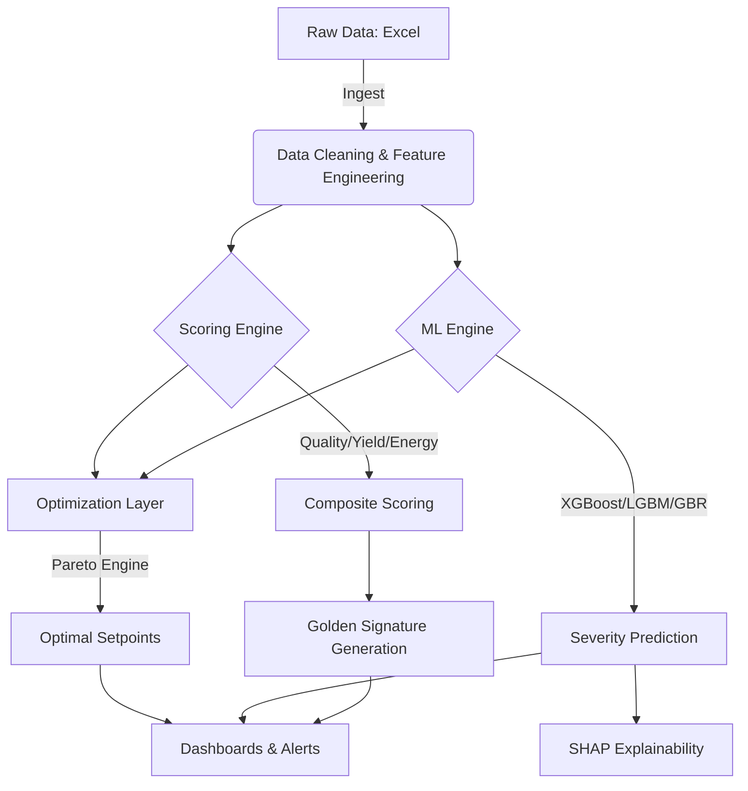

<div align="center">


# 🚀 OptiBatch: Next-Gen Factory Optimization
**BlackBulls**

[](https://opensource.org/licenses/MIT)
[](https://www.python.org/downloads/)
[]()

</div>

---

## 📖 Overview

**OptiBatch** is an advanced digital assistant designed to revolutionize factory batch production. By leveraging multi-objective optimization and predictive analytics, OptiBatch helps manufacturers reduce waste, improve quality, and minimize energy consumption.

The system analyzes historical production and process data to compute **Composite Quality Scores**, identify **Golden Signatures** (the ideal production state), and predict **Batch Severity** using state-of-the-art Machine Learning ensembles.

## ✨ Core Features

| Feature | Description |
| :--- | :--- |
| **🎯 Golden Signature** | Identifies the "ideal" parameter set from top-performing historical batches. |
| **🧠 Predictive ML** | Stacked Ensemble (XGBoost, LightGBM, GBR) with >92% severity accuracy. |
| **📈 Multi-Objective Optimization** | Pareto-based optimization using `pymoo` to balance yield vs. energy. |
| **📊 Intelligent Dashboards** | Interactive Streamlit-powered insights for Ops and Predictive analytics. |
| **⚡ Preemptive Alerts** | Real-time monitoring for vibration spikes and process deviations. |
| **🔄 Feedback Loop** | Continuous learning system that adapts to manual quality overrides. |

---

## 🏗️ Pipeline Architecture



---

## 🛠️ Tech Stack

- **Data Mastery**: `pandas`, `numpy`, `scipy`
- **Machine Learning**: `scikit-learn`, `xgboost`, `lightgbm`, `shap`
- **Optimization**: `pymoo` (Genetic Algorithms)
- **Visuals**: `matplotlib`, `streamlit`
- **Persistence**: `joblib`, `openpyxl`

---

## 🚀 Quick Start

### 1. Installation
```bash
pip install -r requirements.txt
```

### 2. Run Main Pipeline
Analyze historical data and generate the Golden Signature:
```bash
python code/main.py
```

### 3. Launch Dashboards
Explore operational insights:
```bash
python code/ops_dashboard.py
```
Explore predictive modeling & SHAP:
```bash
python code/predictive_dashboard.py
```

---

### 4. Accuracy Proof: 93.02%
Get accuracy score:
```bash
python code/advanced_ml.py
```

## 📂 Project Structure

- `code/`: Core application logic.
    - `scoring/`: Composite score calculation and Golden Signature logic.
    - `optimization/`: Pareto engines and adaptive weighting.
    - `monitoring/`: Real-time deviation detection and feedback loops.
    - `data/`: Ingestion, cleaning, and feature engineering.
- `dataset/`: Historical Excel workbooks for production and process variables.
- `outputs/`: Persisted models, golden signatures, and analysis reports.

---

## 📄 License

This project is licensed under the [MIT License](LICENSE). 
Copyright (c) 2026 **Dev Desai** (BlackBulls Team).

---

<div align="center">
Built with ❤️ for factory efficiency.
</div>